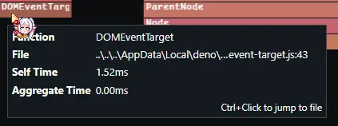
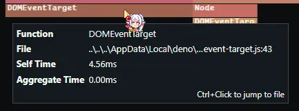
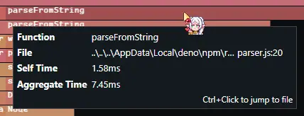
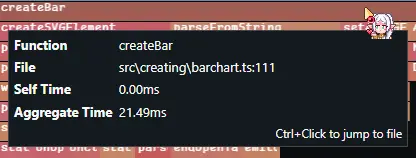
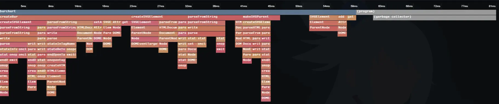
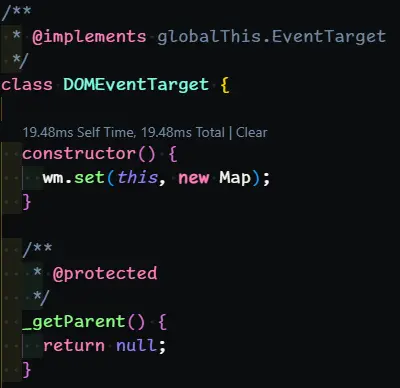

# What is this file?

This is kind of a mish-mash of my thoughts process and progress on things, mainly for myself because I work on this lib / tool primarily in odd bits of time I have which means it's a bit spontaneous, so it helps with remembering what I've been doing and why. It's also kind of a rubber-duck place as well for deciding on things.

Since this is more of a passion project I thought it'd be fun to have here where anyone could see.

The little **update** are usually points in which I had stopped writing prior, but came back not to long after.

# 7/18/2025

Just realized I'm not really using min/max at all lol. I guess for now that's ok, I think incorporating those wouldn't be impossible but would be annoying to calc like a proportional automatic min or max based on given width/height.

Maybe not using it and just always having things be based on the height / width would be best to keep things as simple as possible for users.

Also just thought of labels being on the inside or outside. But that would mean viewbox padding if it were outside and not at the 'end' of each bar, since the start of each would be out of the viewBox. Though this wouldn't be too difficult to implement with a bit of exterior padding to the viewbox when labels are set to 'outside.' Unless that would throw off all the x/y caclulations...

## Same Day Later Thoughts...

### Min/Max?

Yeah thinking about it more, I'm going to remove min/max. I can't imagine a scenario where simple bars would be wanted with a scale much higher than the actual data, or less for that matter.

This also made me think of negative numbers. It would actually be not super hard to do that, automatically i.e. if there's any negative number in the dataset place all bars at center, with negative values below half or to the left, and positive to the right. But I think this might be better as it's own bar type like stacked. type = 'mirrored' maybe. Anyway that's for later regardless.

### Simple plugins

I think it'd also be nice to have a simple plugin system, like one for 'hover tooltip' that'd utilize modern APIs like popover and whatnot. Also a future thing but wanted to record that though!

Misc ideas:
- Auto-generate a small legend to go with a chart
- Hover tooltip utilizing anchor positioning

### BarChart Specific Placement

I think from the start I was a bit 🤔 on the "orientation" key, and I just had the thought that for bar charts - it can just be the four sides. Left, top, right, bottom.

As for an intuitive key, I think "placement" sounds right. Which side would you like your bars sir? The top! Also means functions don't need to be renamed, can pass placement to vertical/horizontal and have that factored into the calculations.

# 7/19/2025

Ok so I've done some more thinking on both calculating bar placement & testing.


## Bar Placement

I think I can make the calculations more consistent, because regardless of which side the bars should be anchored to, the spacing should be the same.

I will draw out a diagram and do some figuring out of the math related!

## Testing

So I like the way that testing is done now, but for development - it's a bit tedious. Each time I want to see the output I have to:
1. Rebuild the module
  - `deno run -A scripts/build_npm.ts 0.0.1`
2. `cd` into `e2e/test-svelte-ts`
3. Run `pnpm install ../../npm`
4. Stop any current tests, and close any stranded chromium windows
5. Re-run `pnpm test:chromium`

This slows me down more than I'd like. I think later on this will be great for having a way to test many frameworks (vitest-browser is cool!) but for development I need something more rapid.

I'm thinking I might use `deno-dom` so I can create elements without needing browser APIs. But I don't want that to be bundled with the resulting library.

So I think I should be able to use a CLI flag when building to not use that, something like `deno run -A scripts/build_npm.ts 0.0.1 prod` or `--mode=prod` which is easy to pick up with Deno.

### Update1

Actually I think that importing a library at all means it will be it the output, but whatever for now I'll roll with it. And I guess that means it'll work server side which is cool and something I hadn't considered. Maybe it'd be better like that??

### Update2

@b-fuze/deno-dom `doc.createElementNS('http://www.w3.org/2000/svg')` unimplemented...

## Docs

The docs will be made with fumadocs! Looks too clean.

## many hours later...

Ok so in figuring out the bar placement, I went down a rabbit hole for a few hours drawing things out on excalidraw. I'll include that in the `extras` folder.

***The read order for it is roughly top-down first, then left to right. Each train of though I'd mostly go down, and then shift to the right & start from the top when thinking through something more different.***

But I think this time I've really nailed the spacing down so I'm excited to implement the new methodology I found. I'm sure this is a solved problem out there but it was fun to arrive at my own answer.

as for the **testing** side of things. Welp, the `SVG` namespace is not yet implemented for deno-dom. Sooooooo either I install an npm package which I'd like to avoid or just continue testing the builds.

I could probably just make a nushell script for it or something, or `watch-exec` it.

# 7/20/2025

Ok so it's the next day, I've finished the first implementation of the new method! And I was considering my options with the whole `deno-dom` reporting that the namespace is unimplemented. But I had the thought of just trying it with `createElement` and that works!

I'm sure thre will be some caveats, but I'll do my best to keep in mind that any weird issues later on could be from this.

## Scales & More?

Did some more thinking about the scales of said charts, and I feel more firmly that not using `min/max` at least for the bar chart is definitely the way to go.

Ultimately, I don't want to try to compete with the many amazing data vis libraries/frameworks that exist and do all the detailed aspects super in-depth and more.

This whole thing was inspired partially by google sheet's sparkline function, I thought it was quite interesting how a simple rectangle could so vastly enhance data readability when used correctly.

So I want to keep the actual data side of creating charts dead simple.

Maybe if I add more charts, more things would be needed, but right now I want to keep the only things needed as an array of data. I had some more thoughts on the labels, which I'll get to later but I think I should do some more testing of the new bar chart creation method before I get ahead of myself.

## Update1

After a small tweak to some math, it's working! For all four sides! I even tested it with rectangular dimensions and it works! Which makes sense but is still nice to see.

Ok time to push.

## Update2

Alright so I think the next thing to do is to remove min/max for the afore mentioned reasons, and then tackle labels, then color.

**Mini update**
Ok that was easy, since I wasn't using them lol.

### Labels

Labels. So like I mentioned prior, I had some thoughts about labels, I think it's a bit tricky all things considered, mainly due to font-size, which also depends on the font-family, and depending on the size of the container, some labels may get cut off in some scenarios & whatnot.

And that led me to an idea... What if I just control them with CSS? Lemme try it before explaining.

**Mini update**
Mission failure! But honestly that's fine. I'm also kind of glad, because I had the scary thought - what if everything could've been spaced by simply using flexbox 💀

But you can control some things via CSS, that I knew already. Like fill & some other visual properties.

I think the best thing to do here, is to do labels how I originally was going to, and then later on it can be improved, and I'll I'll also aim to make a 'legend' plugin as I think this would be another viable option.

I'll just rotatate it a bit as needed for each placement option.

**Mini update**
Luckily that part was pretty simple now, just used the bar coords with offsets as needed. But when the bars are on the right, placing the text becomes complicated - since everything is placed via top-left coordinates the same logic leads to overlap since text is added naturally from the left to the right, and in this case the bars are to the right. If there was a way to like "right-align" text so that when text is added, it's auto-shifted to the right that would be most ideal, or it could be placed via top-right coordinate instead of top-left. I think those both might be possile, but again, I don't feel like going down a text positioning rabbit hole right now.

I had also considered allowing the labels to have a placement mode of "outside" but nah, that's another rabbit hole of now needig to expand the viewbox according to font size & text length and whatnot. I think aligning some labels manually with CSS would be simpler and more reliable. I'll include many examples of doing additional stuff like this (CSS external labels) later. Because again I don't want to get crazy with capabilities - this is meant to be simple & plug-n-play friendly.

One thing I will do though, before pushing this is allow no labels. I think it's time to allow labels to be empty. I'll just have it default to an empty array. As external labels, a legend, or otherwise could be used in place of labels to potientially better effect.

Additionally though later on, I'd like to support image labels. I think a small image could be a great way of using labels.

**Mini update**
Done!

## Update3 - Colors

One thing that hit me just now is responsiveness. I think the simplest way to do that would be making coordinates for things percentages. But I'll worry about that later.

### Colors!

Ah colors, I love how something that seems so simple can be so crazy deep. At least it surprised me how deep the world of color is when I first explored it.

Any oklch enjoyers?

Alright so here's what I'm thinking. Currently for bar charts, the data will have one of two structures.

This: `[1,2,3]`
Or: `[[1,2,3],[4,5,6],[7,8,9]]`

*(stacked charts currently unimplemented, but later I'll do it - just slicing up a rect)*

So I think the simplest thing for colors would be to allow the same data types.

#### E.g.

Data is: `[1,2,3]`
Colors: `['red','green','blue']`

then it's as simple as:
- bar 1 = red
- bar 2 = green
- bar 3 = blue

Additionally I can have it pick with modulo so we just wrap around allowing for something like:

Data is: `[1,2,3,4,5,6]`
Colors: `['red','green','blue']`

then it's as simple as:
- bar 1 = red
- bar 2 = green
- bar 3 = blue
- bar 4 = red
- bar 5 = green
- bar 6 = blue

And so on. This would also work for stacked arrays I'd just be moduloing twice depending on which sub-rect I'm coloring. Also this allows for any color type.

**Mini Update**
Got distracted and did a couple chore type things.

- I've added a "philosophy" section to the readme, where later I'll elaborate on some decisions (like no min/max). But I'll get to that later.
- Updated the readme to have a better checklist of pre-0.1.0 things

Damn it I just remembered I left `barWidth` in the parameters. Prety sure that'd throw off the spacing.
Tested it and yep. Of course. Ok well luckily - I can just use the proper width for calculating coords, and then offset the result by the bar width (if it's different).

Surely it will be simple to implement.

**Mini Update**
Phew, it was as I thought - pretty straightforward. Took like 5 minutes. Ok re-focus time, back to colors!

Except unfortunately I've run out of time for now. I've gotta do some other stuff but I'll come back to this soon!

# 7/22/2025

Two days later & I've done it! In my spare time I've got colors working, and not just normal solid colors - those are working just like I wanted & described above but I've added an additional coloring option! Gradients!

Now gradients is yet another thing that you can really go far with, but for now at least I've kept things relatively basic.

Here's a rough overview of coloring options:

- **No supplied colors**
    - Bars will be colored white when no form of coloring is chosen
- **`colors` array**
    - Colors will be chosen by using module on the index for each bar
        - This means you don't need to supply a color for every bar
        - Or you can add a single color to the array to have all the bars be that color
    - Can be any valid color format
- **`gradientColors` array**
    - When supplied will automatically create an evenly-spread linearGradient consisting of the given colors
        - E.g. `gradientColors: ['#ff00ff', '#00ffff']` will create a gradient like so:
        - ```
          #ff00ff #00ffff
        <-0----------1->
        ```
    - This also takes precedence over the `colors` array when supplied (as-in if both are given, `gradientColors` will be used)
    - Additional optional related params: `gradientDirection` and `gradientMode`, see docs for details!
- Note that **text labels** are not affected by any coloring as of now.
    - Mainly because I'm still a bit uncertain of whether labels will be fully supported given the difficulties involved, and perceived value added by overcoming them. At least for now.
- **stroke** has been largely untouched, but the same process would work for that and I think it would be nice to have as well. That's coming soon!
    - Unsure of whether gradients are possible in the same way. My gut says yes but I haven't tested it. Potential avenues for implementation:
        - I think masking has "border-box" or something related as a property, maybe
        - Could add a second `rect` behind each bar with a width calculated based on desired stroke width & bar width to give the perception of having an outline. This would also allow for coloring in the same way as bars at the cost of increasing the end payload size by a significant amount.
            Perhaps size could be mitigated via `<use>` (I tried this for the gradient stuff but I couldn't get it to work which kind of makes sense I guess, I may revisit it later though!)

This also meant doing a bit of a refactor in terms of output, particularly to support a really cool (I think) way of using gradient colors. That being the `gradientMode` of `'continuous'` which the docs will expand on.

Previously the structure was something like:

```html
<svg>
    <g>
        <rect />
        <text />
    </g>
    <!-- etc... -->
</svg>
```

And now it's:
```html
<svg>
    <!-- defs exists only if using gradients -->
    <defs></defs>
    <g>
        <rect />
        <!-- etc... -->
    </g>
    <g>
        <text />
        <!-- etc... -->
    </g>
</svg>
```

Which I think I actually like more anyway.

## 0.1.0 release

That being said I also did some more thinking and I've decided that for a `0.1.0` release `stacked` bar charts aren't really needed. I don't want to get sucked into the classic "I should do this before putting this out there" and then when I'm done with that I think "wait but this too" and whatnot.

This started as bar charts only anyway so it'll go out with just that!

That also means I've moved the todo-list to it's own markdown file.

# 7/23/2025

So I did some more thinking and had some more thoughts. Crazy, I know.

## I forgor

Ah I'm a fool. I was thinking about using the package myself now that it's mostly usable and then realized a major oversight. The way things are currently setup, with no max for the scale I had not considered making a barchart that exceeds the dimensions of it's container.

Put simply, I've been testing things with values that are less than the resulting size, if I were to use something larger - the bar would be extending past the bounds of it's viewable area. This isn't a terrible thing, "breaking the scale" in a way is also conveying information - but I know it's important to be able to change that behavior.

And tackling this means bringing back some form of `max`, I think what I'll do is:

- Re-introduce just `max` and use this to set the viewbox dimensions
    - Can be optional again, and when not supplied we'll assume something like 15% more than the highest datapoint value
    - Would need to set height or width according to placement option
    - Will keep the no "min" needed

I was also thinking about making things percentages, but that'd still use a `max` of some sort so yeah one way or another, `max` is back.

**Update1**
Alright I'm back & luckily it was a simple fix, just use the max as the viewbox's height or width depending on where the bars are placed.

This also makes me think that I should separate width & height from the element & the viewbox, maybe just as an override. But I want to field test things more before I do that.

## Docs

Aside from that the docs site is going well! It's a bit overkill feature-wise but fumadocs makes for a very slick experience just like I wanted. It's also fine because I don't need to use every single feature offered.

Probably a few more days to finish up the first version of that as I want to include loads of examples.

## ssr, react, & more

Initially I had planned for this lib to be client-sided, but the usage of `@b-fuze/deno-dom` allows for this lib to server-side as well.

There's a couple issues with it though.

### no `createElementNS`

Right now I'm just using `createElement` because `createElementNS` doesn't exist. While this hasn't resulted in any major pitfalls I'm imagining at some point I'll run into some sort of issue due to that.

The lib `deno-dom` is still alive though, with the most recent release being 2 weeks ago at time of writing. Perhaps I'll contribute as well?

I have noticed one issue though, that being that for whatever reason, when doing `setAttribute("viewBox","0 0 300 300")` the resulting HTML has `viewbox` instead of `viewBox`, it ignores the uppercase `B`. Luckily modern browsers don't care too much about that, and render it anyway but it does cause some warnings.

So that leaves a couple options.

a. abandon `ssr` for now, focus on client side only like originally intended.
b. roll with it, there's still no actual issues with things now, and switch libs later or hope for `deno-dom` to get Updated
 - (or help move the update along myself)
c. find a different way of creating elements for `ssr`

I'm leaning towards either `c` or `b`. Deno is awesome, and iirc one of the things it enables is a way of using languages outside of js/ts in projects.


#### `c`

So if I could find a library compatible, in any language I could potentially use it. What I'm worried about that though is **bundle-size.** Since I really want to keep this lib lightweight. I'll have to research that more, but it sounds both intersting, and potentially very viable as languages apart from js/ts could be significantly faster.

#### `b`

Option `b` is probably the more realistic option though, and for the time being I'm going to stick with what I have. Again, there aren't any huge issues as of now, and it works pretty seamlessly.

### environment detection

One thing I encountered when I was using the lib myself for the docs site was the fact than in react, the `class` attribute is `className`. That's pretty annoying. I've now got to figure out how to account for that. In the short-term a param for it would work just fine, but I want to be able to auto-detect this.

With `vite` you can do `import.meta.env` and read the dir contents, perhaps something like this would work & I can look for `.jsx or .tsx` file extensions.

Though if the function is used inline, I wonder if it would even be an issue, I was only seeing that get flagged as an error because I was pasting the SVG in directly instead of calling the function inline, since it was for including an example of the output.

For now I'll add a param that allows you to have the output react-friendly and later maybe auto-detect env if it's an issue.
- `className` instead of `class`
- `xmlnsXlink` instead of `xmlns:xlink`

I wonder if it should also detect if it's client side automatically to use `document.createElementNS` instead of `deno-dom`. That's a good idea I think.

**Update1**
I just looked through the `deno-dom` repo a bit and found a doc describing some of the goals for the lib. There's a section called SVG and right now it's described as "???" 🤣 funny though since it still is working alright for SVG elements!


**Update2**
Wait I just realized, the usual convention for this (I think) is to have framework-specific imports I think. Something like:
```ts
import { barchart } from 'nanocharts/svelte';
// or
import { barchart } from 'nanocharts/react';
```

I think this is better than what I was thinking with auto-detection of stuff, though it is an interesting idea. But I'll get to that later anyway, there's still much to be done for the core itself.


# 7/24/2025

The lib internals itself are a bit unorganized, as I've been doing a bunch of 'figuring out as I go' but that doesn't mean I can't stay organized. I also want to always keep that core philosophy in mind of being simple to get value from, but with the ability to take things further if you wanted something a bit more.

## Naming

I did a bit of thinking on this, and while I like the idea of having everything under one function, similar to `SPARKLINE` I think keeping exports divided based on the chart type would benefit the end bundle size, if my understanding of how that works is correct that is.

```bash
 └─ tests # unit tests
 └─ e2e # framework specific & other usage tests
 └─ src
    ├─ utils
    │  └─ maths.ts
    ├─ creating # element creation relating to chart of filename
    │  └─ barchart.ts
    └─ main.ts
    └─ barchart.ts
    └─ etc... # more charttypes.ts
```

# 7/25/2025

For now going to just commit to `deno-dom` to make it less janky internally, and I think I've settled on wanting this to work in non-browser contexts as well.

Still need to do a bit more before 0.1.0, that being:

- Cleanup
    - Match the above organizational goal
    - Do less "checks" for the user, with proper docs & error messages I shouldn't need to check things for the user really. This isn't referring to the default creation. I know that you can have default params but some of them are based on the presence or absence of other params so I'll leave that stuff for now.
- Docs site
    - So far so good, fumadocs is awesome.
    - Main docs remaining:
        - Barchart page
        - Loads of examples

# 7/26/2025

It's the weekend now, didn't get much done yesterday so I was eager to wrap up the 0.1.0 todos. I go to test things out by building things, and I'm met with:

```
error: Uncaught (in promise) "Not implemented support for Wasm modules: https://jsr.io/@b-fuze/deno-dom/0.1.52/build/deno-wasm/deno-wasm_bg.wasm"
```

...


Welp, no more `deno-dom`. Did a bit of research and looks like `linkedom` is what I'm looking for! This should also resolve that issue I was having with casing of attributes, where `viewBox` was being output as `viewbox`.

I realized it was more problematic than I initially thought because it was also affecting the `gradienttransform` attribute which is needed for rotating gradients.

Maybe I can use the esm shim import? But I don't know if that's better than just installing it 🤔 lemme do a bit of research on that. **Update** is that it's pretty much the same thing as far as I can tell, I didn't dig too deep as `linkedom` is actually quite lightweight which is nice. I installed it just to keep consistent with having already installed things.

So no more `@b-fuze/deno-dom`! Unfortunate as WASM is pretty cool & should be faster - but `linkedom` looks to be also focused on performance so it shouldn't be a noticeable difference really, I'll switch back as the WASM side of things matures.


Did a bit more looking into it and `linkedom` mentions deno in a recent update which is cool! That update also mentions workers being added, which I'm not sure if that refers to creating workers like in browsers or that the lib itself can now leverage workers. Either way the more I think about it the more my dismay about switching lessens.

Couple nice things with `linkedom`:
- Can now create in the SVG namespace like in browsers! No more asserting the output type!
- No more casing issues!

Ok I'm repeating myself at this point but what seemed like a major setback turned out to be an absolute win! Ok back to adding examples!

# 7/27/2025

Interesting start to the day!

After much fiddling with things, I finally got pretty much all the `0.1.0` todos wrapped up.
- Basic logo
- Basic Docs site
    - Up and running on github pages after a bunch of wrestling with some auto-generated things
- Exports and everything in place


Then I went to publish the npm package, now prior to this I *had* checked that the npm package with the name "NanoCharts" wasn't taken - it wasn't!

So I go to run `npm publish`, I login, all of that, and then at the last moment get hit with a message saying "NanoCharts" is too similar to existing package "nano-charts"!

I go check it out, lo' and behold - someone with quite a similar idea to me! Though this package had not been updated in about 7 years.

Alright then I'll go "minicharts" nope, also taken, same idea as well! Haha the odds! This time though it's 8 years ago. Ok surely "toomanycharts" will be available... Nope! Also taken, this time 8 months ago, though this one has no README or repo linked which is interesting.

I even partially committed to "toomanycharts" before realizing, I thought for sure that one would be available, 😆 you know what, I'm thinking I'll go with "toomanycharts". In the spirit of things, this one isn't taken either.

If I get a message saying someone has "too-manycharts" when I try to publish under that I'll explode.

**Update**

Phew, that one was available as I thought! Version `0.1.0` is out! I'll be doing the stacked barcharts next I think.

# 7/28/2025

Ok so I've done the basic implementation for stacked barcharts, and it felt almost too simple. One thing I've realized is that I didn't think about how the labels for stacked bar charts would be colored. It made me think that labels should have their own color parameter, which could be just one color, but I could also let it have multiple colors to also allow for alternating colors.


Writing this down here, but I think allowing for **images** somehow would be really nice. I'll think it through later, but would ideally introduce much more overhead on the page, don't want to block anything. Hmmm. I know JS has the `Image` constructor but not sure if that'd be the best option. Couple ideas:
- Image
- Actual ` `labelClass`

Then while I was doing a bit of work on test coverage - I realized I forgot about `textGroupClass`. So!
- `textGroupClass` -> `labelGroupClass`

Since this whole lib is in the early stages I won't just mark it as "deprecated" or anything, just going to fully rename it now while I can.

Which got me thinking if a "CHANGELOG.md" would be good, but I've got a nice doc site already, so I think that would be better there!
Changelog page on the way!

**Update1**
While working on coverage I saw that the coverage wasn't picking up a certain part of that nested ternary used for the color picking.

```ts
const color =
  isGradient && gradientId
    ? gradientMode === 'continuous'
      ? 'transparent'
      : `url('#${gradientId}')`
    : colors && colors.length > 0
    ? colors[i % colors.length]
    : ['#ffffff', '#aaaaaa'];
```
particularly the "url" bit which is when it's a non-continuous gradient. Though I checked the output & see that that is being used for non-continuous gradients, but honestly it's a bit of an abomination so I don't blame the coverage check.

I think that's a sign that it's time to split this up into a good ol' if/else if/else block!

**Update2**
Turns out it wasn't the url part that wasn't being used, it was the normal colors part - I guess I misread the little indicator in the html output. It's fine though as that ternary shouldn't exist anyway.

**Update3**
In the coverage it shows that this is uncovered:
```ts
if (typeof document !== "undefined" && document instanceof Document) {
    return document.createElementNS("http://www.w3.org/2000/svg", ele);
} else {
    const { document } = parseHTML(
        `<!doctype html><html><head></head><body></body></html>`,
    );
    return document.createElementNS("http://www.w3.org/2000/svg", ele);
}
```
Which makes sense, because I don't have a test with a global faux-document anyway. I'm not sure if this check is even needed, since linkedom is imported it will be bundled regardless if my understanding is correct, so I may remove this later but for now I'll ignore that.

**Update4**

Ok just about everything is at or above 90% for coverage. Going to stop now. Only oddity is the `barWidth` param, that was reported as not being covered for the cases where it's not equal to the automatic `evenWidth`. But I remember trying that out & visually it looked correct so I'll leave it as-is for now.

Need to update docs as I think barchart stacked is pretty much good to go!

# 8/1/2025

So I've begun work on the linechart, and I've already got a bunch of thoughts / things to figure out. Gonna write them here to not  forget.


## Multiple Lines

Was thinking I'd do a `linechartMulti` for drawing multiple lines. But then I thought I might just allow the `data` to be `number[]` or `number[][]` instead of two separate functions.

Except that would go against how it was done for bar chart stacked. I think I'll make a separate function to keep things consistent, and beccause it would be better for bundling to split things up.

## Scales?

With bars it was easy to not really need scales / a grid. But I'd been thinking about it & I feel like something scales related could be really helpful for linecharts.

Considering this as the output:


That doesn't really need scales or anything. And that's plenty in terms of gleaning information. But what if you wanted this:


That's different. It conveys different information. But how much? I think enough to warrant having that functionality. Except now that I'm thinking about it, I don't think it needs scales.

That's the midpoint basically. So I think in using this space as a rubber duck I've landed on a good solution, allowing a midpoint to be specified. Otherwise we'll start from `0,0`

## Labels Overhaul

After doing some late night / random thinking about things I've come to a point where I'm thinking labels could be quite important in some use cases.

That being said they've kind of taken a backseat to the actual visuals thus far, and rightfully so I might add - but I think I can see how they could be extraordinarily useful.

The tricky thing is that their implementation will depend on the type of chart. So I'm going to finish the 4 basic chart functions:
- `barchart`
- `barchartStacked`
- `linechart`
- `linechartMulti`
    - Name likely to change for this, sounds bad??

Then I'm going to do some framework specific packaging, and then I think overhaul how labels work. Rough intended feature list:
- Image labels
- Truncation
- Perfect-Placing mode?
    - So it can be tricky, but I know it's possible to truly perfectly place text by calculating how big the resulting box would be based on the font used, and font-size.
    - This would definitely be optional, because I'd imagine that this would be a non-trivial calculation which could add up depending on the # of times run.
- for barcharts > centered on bars
    - right now labels are only placed on the ends
    - I think it'd be fantastic to do something like:
    ```
    =------=
    |  #   |
    =------=
    ```
Maybe some more things too. We'll see!
**Note to self** add this to the roadmap page.


**Update1**
`linechartMulti` -> `linechartMany` sounds better I think!

**Update2**

The `linechart` won't have a `placement` parameter for now since it's read strictly from left to right, and if you want to rotate it you can just use `transform` on it.

...Also just realizing I could have just done `place` instead of `placement`... wdjaiojwdiowoijqowj
I'll make that change with the linechart update, less to write and more in-line with CSS naming.

I'm also thinking I'll move some mathematical functions out of `maths.ts` and into the relevant `creating/chart-type` files to keep things more organized.

Or maybe a `maths/` folder with corresponding names? Or would that be excessive, hmmmm... I think that sounds better, then the folder structure would be something like:

```
├─ src
│  ├─ ...
│  ├─ utils
│  │  └─ ...
│  ├─ creating
│  │  ├─ common.ts
│  │  ├─ chart-type.ts
│  ├─ math
│  │  ├─ common.ts
│  │  ├─ chart-type.ts
```

Which feels sensible to me I think. And I think this would also benefit bundling. But I think I will have one per type, instead of 1-to-1.

So instead of:
```
├─ src
│  ├─ math
│  │  ├─ common.ts
│  │  ├─ barchart.ts
│  │  ├─ barchartstacked.ts
```

I'll do:
```
├─ src
│  ├─ math
│  │  ├─ common.ts
│  │  ├─ barcharts.ts
```

Since the variations of similar types usually share the underlying bits. It would also mean this won't be doubling overall files.

# 8/10/2025

So it's been a bit since I've written here, but I've been making steady progress nonetheless! I re-did the whole deno testing setup to allow for rapid prototyping, as before I had a half baked workflow of running tests with that now-unused `saveIfReal` function, and then opening up the resulting SVG in the browser.

Now that whole process is automated! The `deno` ecosystem is awesome, it was pretty easy to figure out how to get sub-workspaces to run at the same time. The only thing I couldn't figure out is how to "watch" when running more than one task at once, since when I called it with `--watch` the first task would just sit on "watching" and the sub-tasks wouldn't get run. That's why I setup a version using the `watch-exec` external tool which I know isn't best practice, but it's also entirely optional, and not a huge deal as  of now.

## Gradients

So from the start I knew I wasn't tapping into the *full* potential of gradients. For one, I've only incorporated a single `linear` gradient. There's also `radialGradients` and normally you can use multiple gradients at once.

This decision to go for more of a rudimentary level of gradients was made after thinking things through!
- Radial gradients I think in the context of charts wouldn't even look to great (from what I can imagine using them)
- Multiple gradients while powerful isn't super common, and since charts are mainly for conveying information, having super complex multi-gradient backgrounds could detract from that.

BUT I do plan to add those things at some point, it just doesn't feel worth it any time soon. That being said I realized one feature of gradients that I think *should* be added, and that's custom stops.

Currently the stops for linear gradients are placed automatically distributed evenly, meaning if you give two colors you will always get a gradient of 50% one color and 50% the other. While this is mostly fine, since you can supply more of the same colors to pseudo-place the color stops, I forgot about  hard-stops!

Like a barbershop swirl or candy cane stripes, the current setup means stripes of that kind are impossible. So custom `stops` are on the way soon! They'll be optional of course!


# 8/13/2025

After thinking about it, I am thinking that maybe there shouldn't be a `linechartMany` and instead it should be just `linechart` and you can make one or many lines depending on the `data` parameter. Hmmm... 🤔 But that would also mean doing a bunch of annoying typescript assertions for parameters.

Oh wait I just realized the solution, it should *always* assume many. `data` should just always be `number[][]` and not `number[]`. The function can make one or however many lines!

Time to go delete the singular `linechart` and make the `linechartMany` into `linechart`. I don't know why I didn't think of this initially.

Maybe I can allow `number[]` and just check if the Array is one-dimensional and if so just throw it in array internally. I also realized that the `linechart` is a bit more involved since I think ultimately I want to allow styling of each line, which would mean multiple gradients. But the current setup doesn't allow for that.

Though perhaps that's a bit excessive? I think to me it also sounds fine because I really enjoy thinking of things in terms of arrays, but I hope it would still be intuitive to others.

Right now it's something like:
```js
{
    gradientColors: ['red', 'blue']
}
```
Which would produce a `red-to-blue` gradient.

But I think it wouldn't be too hard to allow:
```js
{
    gradientColors: [
        ['red','blue']  // -> a red-to-blue gradient
        ['green', 'yellow'] // -> a green-to-yellow gradient
    ]
}
```

Which I feel like is pretty intuitive. This is also how colors work, and this same kind of "as many as wanted of said style" works because of the alternating nature of them, where even if you supply two colors for 10 data points, we just go loop the choices. So I think this does feel intuitive!

But what about color stops... Hmmmmm I don't want another argument for just those, I think that would be too hard to match to the numbers.

In CSS, there is no color type that uses `:` so what if it went something like `<color>:<stop-percentage>`. According to the [spec](https://svgwg.org/svg2-draft/pservers.html#StopElementOffsetAttribute) the `stop-offset` is either `0-1` or `0%-100%`. I think the  percentages are a lot easier for most people so we'll roll with that. It means things could look like:
```js
{
    gradientColors: [
        ['rgb(255, 0, 0):30%','rgb(0, 0, 255):60%']
    ]
}
```
Which feels pretty fine to me. Except that would mean additional checks for `:`. Which I don't think would be super costly. Otherwise it would be assuming the next value in the array is a stop:
```js
{
    gradientColors: [
        ['rgb(255, 0, 0)', '30%', 'rgb(0, 0, 255)', '60%']
    ]
}
```
Which seems a bit more 'normal' but I want stops to be optional, like maybe only the `30%` is there and not the `60%`. We can't check for `%` because there are color formats that use `%`. So yeah I think that decides it! It'll be `<color>:<stop-percentage>`!

Now I wonder if I can make this into a typescript mapped type...

**update**
Common TypeScript W
```ts
type MakeRange<
  N extends number,
  Result extends Array<unknown> = [],
> =
  (Result['length'] extends N
    ? Result
    : MakeRange<N, [...Result, Result['length']]>
  );

type MaxP = MakeRange<101>;
type Percentage = `${MaxP[number]}%`;
```


**update2**
Ok I've consolidated them! The beginning of the function is a bit verbose as I'm turning a bunch of stuff into arrays if it's the singular version, but it feels much better than having two versions for a singular line or multiple lines.

Cool!

I think a bit more testing and it'll basically be usable!

# 8/14/2025

So I had a terrifying thought, what if I should have combined `barchart` and `barchartstacked`!?!? But then I remembered that was how I started and it was cumbersome, and increased the import size because one function had both implementations. Bar Charts are a different type of chart compared to a Stacked Bar Chart, whereas the linechart ordeal was just more of the same thing - lines. So the import size isn't increasing nor is the implementation different, it's just looping over inputs.

Ok so time to implement gradient color stops!

# 8/17/2025

So I added the gradient stops, revamped testing, got coverage to 100% with some more tests. Everything looked well & good so I pushed an update! Then I tried making the test with a bunch of datapoints smooth, and it looked wrong. It just happened that my test with three datapoints looked "ok".

A bunch of research later I had a basic understanding of the math for drawing bezier curves, but I couldn't wrap my head around implementing that into the `<path>` element.

After a bunch of manual math with paper & pen, a temporary test setup with manual writing `<path>` elements & each coordinate + set of control points, trying 1000 things, I figured it out! It was actually thanks to the example usage of the `<path>` element on `mdn`.

TLDR is that the formula for ideal smoothness is to use the x of the midpoint between each set of points & the first point's Y / second point's Y for the control points. It only took like almost 5 hours to figure out.

# 8/18/2025

I just remembered about the existence of grouped bar charts...
```
#----------
#
#=====
#===
#==
#
#=====
#===
#==
#
#----------
```
Do I make this last chart type before overhauling labels and doing a bunch of standardizing of things? Hmmm... I think this chart type is quite useful, and while not super straightforward I think it's also not super complicated. Hmmmm 🤔

Initially my gut said "yes" but I actually think standardizing things is the way, it will be easier before adding a whole new chart & will lead to a smoother + more consistent and overall better future implementations. So that's up next!

# 8/19/2025

So my first step in standardization of things is making sure the parameter types are consistent in naming & influence on output, and I'm already at a bit of an impasse when it comes to a specific aspect, particularly, `max`, `height`, and `width`.

## Dimensions

Long ago I removed `min` for barcharts, since negative values aren't visible in a barchart, and I don't see how a min other than 0 would work anyway. I think that this is still the correct move.

But upon rexamination of `barchart` I realize that `max` doesn't really do anything either 🫠, which is pretty simple to fix. I think I'll make it so that `max`, when set will override the viewBox's height or width (depending on placement).

Which brings me to my next consideration. `height` and `width`. Right now this is used for both the `viewBox` *and* the actual `height/width` attributes. But those both do different things...

My first thought was "I'll just separate the height & width into two - vHeight/vWidth for viewbox & height/width for attributes." But then I was wondering about how intuitive it would be in terms of influence on end result as I'm not sure many people are familiar with `viewBox` & how it works. Though I think it's actually not that big of a deal.

What I think I'll do is:
1. Split the params as mentioned.
2. Put in the comment for the viewbox params a "if you're not sure about how to use this parameter, check the docs!"
   1. Viewbox params will default to height/width if not supplied

This brings me back to `linechart` though. Values below `0` make sense here for the `y-axis`. But there's no `min` as of now. I think for linecharts I will
1. Re-add `min`, and allow it to override the `viewBox` height's min.
2. Auto-calculate `min` based on the lowest found value in given data.

Thanks for helping me think this through markdown 👍

**Update**

Of course that somehow broke everything...


HOW DID CHANGING HEIGHT & WIDTH PARAMETERS BREAK GRADIENTS!?!?!? AHHHHHHHHHHHHsidjioqwdjiqwojiwq.

**Update2**

Turns out it wasn't the height/width change but rather an ultra simple oversight I fixed for `barchartStacked` but not normal `barchart` ages ago...

That's what I get for not writing actual tests lol. I guess I'll also make the tests more robust soon too.

# 8/20/2025

So I'm working on the label overhaul, all is well and  good. I have also chopped up some implementation bits for things, which I think will lead to both better bundling and DX later on. I have also decided to deprecate `labelColors` in favor of styling via CSS for a few reasons.

With the overhaul I'm introducing more labelling options, and that would mean doing work to check 2 additional arrays of colors which isn't that bad but also feels a bit excessive when you can just target the text class directly. That also will result in a smaller output as that's one less inline attribute for every text element.

Any way, I've gone and done the separation of things, tests looking good. Except I'm now back at that previous conundrum that has to do with sizing. Since the size of the text & font family influence the output element's size it's hard to get perfectly centered. "Alright, I'll go & calculate the true position using the font family & size." Or some other way.

- `SVGTextElement.textLength` > `undefined`
- `SVGTextElement.getComputedTextLength()` > `Error: Not a function`
- `SVGTextElement.getBBox()` > `Error: Not a function`
- `SVGTextElement.getBoundingClientRect()` > `{x: 0, y: 0, top: 0, bottom: 0, left: 0, right: 0, width: 0, height: 0}`
- Searched all three of the above methods:
    - in the repo > 0 results
    - in repo issues (closed/open) > 0 results
    - in google with linkedom + method name in quotes > 0 results


Time to see what other options I got.

**Update**
Just as I was about to go digging for the source impllementation for `getBBox` or `getBoundingClientRect` a thought hit me - can't I just 'center-align' the text instead of having it left aligned????............ Yes....

Enter: `text-anchor`! So this is going to need another parameter for choosing either `start`, `middle`, or `end`. But that's a simple one. I was also considering a potential parameter for placing the labels, similar to that of the bars in barchart. Something like `left`,`above`,`right`,`below` which I might end up doing. Would need a 'smart' option for linecharts that checks the previous point to avoid overlapping with the line, unless you give the text a background so it's always visible.

**Update2**
You know what, actually I'm going to be opinionated here & not expose that option. For now. I think the 'details' side of things is something I will come back to for everything but I don't want to get too caught up in every little possible thing to add currently.

# 8/21/2025

And now I'm thinking of re-adding `labelColors` and it would just be used for all types of labels. Hmmm... Ok! It's a simple addition so I digress.

# 10/28/2025

Wow it's been a while since I've written here! But I'm back and looking to continue making progress.

So I haven't written here in a while, but I *have* worked on the lib more recently. The last thing I did was overhaul labels! Now images can be used with labels, with or without text labelling said image which personally I think is quite cool!!

Going back to the roadmap in the docs site, after the labelling overhaul the next thing on the list is 'framework-specific imports' which I think is mainly the TSX side of things as this lib generates inline SVGs for use in pages & I'm not sure making it a component that you can pass values to via props or attributes has much value. In fact I think that would add another step of work as now it would also need to be taken care of by the framework itself as opposed to the universal inlining. But I'll need to do more research on that & whether that thought is accurate as I'm not opposed to making a framework specific component if it really adds value. Like for svelte, maybe then you can take advantage of the `transition:` syntax. We'll see!

Before that though I think I need to do some more chore / cleaning & standards / bigger picture decisioning. Since I've not worked on this project for a bit I have a fresh lens for making sure I'm makign the right decisions with how I'm doing things. 

It's essential that prior to continuing to add new features and functionality I vet my foundation, otherwise continuing to build on top will lead to what I've built crumbling! Of course that's being a bit dramatic but basically the better things are for the foundation, the better everything built on top will be!

So now I'm going to go through & do a bit of reflection on decisions, identify a list of "foundation strengthing todos" and that will be my next task before moving onto the next feature!

## Ultimate goal(s) & Lib Intention

So one important question that I must be confident in, is "why am I making this library?"

For that, I think I have a pretty great answer for. The bottom line for this is to make an **intuitive, low footprint library for making charts.** 
I want to save developers (and maybe anyone trying to make charts) time.

### Learning curve

Making charts should be intuitive and easy, users should be able to install the library and have a chart rendered on their webpage with as few lines of code as possible.

Developers ideally wouldn't need to worry about tons of config to get charts to show up, to have them be responsive, or to render properly with minimal performance overhead. 

The goal is to have this philosophy of ease of use with minimal drawbacks to output effectiveness should always remain true!

I also want to continue to enable powerful visuals *while keeping the way of doing so as simple as possible.* Everything should be intuitive!

### Performance & Footprint

This library should always be highly performant! Having the output be inline SVGs is already amazing, but I will do my best to keep the library itself and all operations as performant as possible.

Additionally the import cost should be minimal which it currently is, and should also hold true.

Here's a current benchmark result (see `tests/speed.bench.ts`) which is mostly acceptable given how many things it's doing, but I bet I can do even better. I want it to be extremely fast, such that speed is never a concern.

| benchmark                      | time/iter (avg) |        iter/s |      (min … max)      |      p75 |      p99 |     p995 |
| ------------------------------ | --------------- | ------------- | --------------------- | -------- | -------- | -------- |
| test1kRandomBarCharts          |         79.3 ms |          12.6 | ( 48.2 ms … 333.2 ms) |  74.0 ms | 333.2 ms | 333.2 ms |
| test1kRandomStackedBarCharts   |        227.4 ms |           4.4 | (140.7 ms … 507.0 ms) | 254.0 ms | 507.0 ms | 507.0 ms |
| test1kRandomSingleLineCharts   |         71.3 ms |          14.0 | ( 22.6 ms … 491.5 ms) |  41.4 ms | 491.5 ms | 491.5 ms |
| test1kRandomMultiLineCharts    |         96.1 ms |          10.4 | ( 50.0 ms … 526.9 ms) |  65.2 ms | 526.9 ms | 526.9 ms |

## Styling

So this is something that I'd been constantly thinking about, "should I make this colorable?" "should I add an option here for this attribute?" 

And while I so far I've done a good job of deciding on that, I'm going to set in stone a stance on what should and shouldn't be styled.

**CSS today is more powerful than ever before.** That being said I think it would make sense to **enable as much CSS-based styling as possible.** But also providing **useful** styling where possible. Because, on one-hand the less end-users need to do to get good looking visuals, the better. BUT I also don't want to limit what can be done to the output.

What does "useful" entail? Well according to library goals, styling that would otherwise be non-trivial / extra time consuming / introduce additional overhead to implement manually that provide significant value to output.

**Useful Styling**

For example; alternating colors. To get alternating colors with CSS you'd need something like so:

```css
.target:nth-child(odd) {
  fill: #ff0000; 
}
.barchart:nth-child(even) {
  fill: #00ff00;
}
```

Which isn't that huge of a task, but now you need to write that, targetting the correct bar chart, and you may need to re-write this targetting a different charrt for that to have separate alternating colors. But as an option:

```ts
barchart({
    data: [1,2,3],
    colors: ['#00ff00', '#ff0000']
});
```

That's much less to write, especially when not counting the rest of the function invokation that would be written anyway.

Stuff like this are integral to appearance, any of which would be more work to write manually. So all basic styling *should* be doable easily in the place that the chart is initally created. It would suck if to get a red bar chart if that's all I wanted I need to set a specific class on the barchart I'm making & then add a new style tag or stylesheet that I might not have had otherwise.

But users *should* be able to do that if they want.

Then of course there's things like gradients which would be loads more work to do via CSS.

## Naming

> "The two hardest things in programming are cache invalidation & naming things."

So far I think I've done a pretty solid job naming most things. But I think I've also come to realize I can do better...

A more complex chart invokation could look something like:

```ts
barchart({
    data: [250, 50, 100, 150, 100],
    width: 300,
    height: 300,
    placement: 'top',
    gap: 3,
    gradientColors: [
    'oklch(0.7017 0.3225 328.36)',
    'oklch(0.9054 0.15455 194.769)',
    ],
    gradientDirection: 'top-to-bottom',
    gradientMode: 'continuous', 
    dataLabels: "percentage",
    labels: ["A", "B", "C"],
    barClass: 'chart1-bar',
    parentClass: 'chart1-parent'
});
```

Which I personally think isn't too bad. One thing I've been **intentionally not doing** is creating nested params, because I really wanted to steer very clear of nesting way too much as I think that really makes things over complicated for end-users & for internals.

But I'm thinking that one-level nesting for related configuration options, would actually greatly improve readability & enhance intuitiveness. Particularly for classes.

I was also thinking styling, but then that starts going into that rabbit hole of how nested should things. Like gradients, should they remain top level? Well they're styling so it should be in the styles, but now "colors" would be potentially another object like:

```ts
barchart({
    styles: {
        fill: {
            gradientColors: []
        }
    }
})
```

Or it could be top-level in the stlyes but then you'd still be typing more for the same param name. Etc.
I think for now just classes can be nested.

Anyway, that's one bit of naming the other half though is finding that balance between accuracy & verbosity.

Coming back to this project after taking a break, I'm seeing some issues with some names. One that sticks out to me is `"colors"`. 

```ts
barchart({
    data: [250, 50, 100, 150, 100],
    colors: ['red','blue']
});
```

Seeing that on it's own, you wouldn't know what those colors are doing! IASHdijwqjdqwjiowdjiowqdijoq damn. Now I need to change this in a ton of places. 

The only silver lining here is that this would be way worse to change later on.

Additionally, I think because the function name includes the chart type, I don't need to repeat that in the parameter names. Meaning instead of `"barFillColors"` I think just `fillColors` is fine.

Anyway I think I'm done rambling for now. So that's the next order thing to do, naming & I'll combine that task with adding some more basic styling options.

## The "Foundation Update" ToDo list

- [ ] Revamp some parameter naming
  - Important, but this is going to be really annoying
  - Did it for coloring, need to fix naming for classes!
- [x] Standardize styling choices
- [ ] Document project structure
- [ ] Improve performance significantly!

# 10/29/2025

So I'm back with more naming thoughts.

I renamed `"colors"` for barcharts to `"fillColors"`, and I added both `"borderColors"` & `"borderWidths"`... But then I realized, it should be 'stroke.' So I'm going to change those to `"strokeColors"` & `"strokeWidths"` for accuracy. I think most people might think to look for "border" over "stroke" so I'm considering adding both, and using whichever is present but that's additional logic for something small.

I think a better solution is robust documentation, maybe with a visual guide pointing out what each part of a barchart is reffered to in the params. Oh I'm also going to add a way to customize whether corners are rounded, I think that'd be linecaps maybe or some sort of corner radius.

I also ran into one other parameter that I think needs updating, which leads me to another slightly bigger conversation.

I'm talking about the `"max"` parameter... In terms of this library "max" refers to the max numerical value to show visually.

Currently the max is auto-set to the highest value in the given dataset rounded up to the nearest tenth. The reason for this being that for the most part, bar charts typically don't have bars that hit the max value shown in the chart. Of course sometimes this *is* desired behavior and I've allowed for that via the `"max"` parameter.

Changing this to `"maxValue"` is simple and something I'll do.

But then I also thought about other basic chart features, like a grid, with scales & step amount. Now I want to keep config as simple as possibe, because I stand by the notion that even a simple chart of only bars, shows something. Labels also add greatly to information conveyed. And now I'm thinking about how much showing scales adds to a chart.

On one hand I think it does add to information conveyed, but it also steps into potentially "extra" territory. Hmm I need to think about this more.

Then there's other features, like axis titles, hover functionality, and more. I think an axis title would be easy to add, just manually wherever you actually place the chart with the power of flex or grid positioning, but this could be 'nice to have.' 

The thing is though, that then, every chart after this would need some form of a title. And adding this to the charts is definitely non-trivial. I think I'd go about it by nesting the SVG of the bars within another. But I'd have to be careful of how that affects things like the viewbox. Time to do some testing & thinking!

# 10/30/2025

Ok I've decided. I think axis titles would be helpful, but I think I'm in favor of instead providing a function to generate a corresponding legend.
- Better responsiveness
- Better bundling as it can be fully separate
- Would work for any chart as it would be based on colors & corresponding user-supplied titles

A legend, paired with already robust datalabelling capabilities would be sufficient to not lose information. Maybe later I can add in a way of creating axis titles, but that'd only even work for bar / line and other grid-based charts.

# 11/5/2025

So I've gone and done some parameter name updating, and added a couple parameters for styling some of the basic elements of charts (stroke width & color).

Now I'm working on improving performance, as this felt like the natural next step and is something I really want to have in top shape.

That being said I've already arrived at some really confusing conclusions... Let me walk you through things.

## Tidying Up

In preparing to properly test things I decided I'd clean up the commands for running benchmarks. So I did a small bit of tidying there, `deno.json` now has a named benchmark command with a description & the old singular `speed.bench.ts` file has been moved into it's own `'speed'` folder as I'll be doing some more benchmarking I also renamed the file to be less generic, instead of `speed.bench.ts` it's now `1k_random_allcharts.bench.ts` which at a glance tells you what's being benchmarked.

As I was doing that I took a look at things, and noticed a potential glaring issue with how I was doing things!!!

Take a look at see if you can spot it:

```ts
Deno.bench(function test1kRandomBarCharts() {
  for (let i = 0; i < 1_000; i++) {
    const rd = randomDataArray();
    barchart({
      data: rd,
    });
  }
});
```
.
.
.
.
.

I put the random dataset creation *in* the benchmark... Oops! While this probably doesn't have that huge an impact on overall performance, it definitely could & shouldn't be part of what's being benchmarked.

So I moved it outside & instead created all the random datasets at the top outside of the benchmarks. This shaved off about an average of `~12-18ms` for each type of chart benchmarked... Except the first, that seemed to actually be `3ms` slower??? I checked twice and again seemed about `3ms` slower than when the randomdatasets were created within the benchmark.

This leads me to believe it's impact was negligible, which makes sense as the random datasets are pretty small. Each array created has `2-5` numbers, with a value ranging from `10-300`.

Ok onto the next idea!

## Profiling

This I didn't spend a ton of time on, as I feel like figuring out where the performance bottleneck lies wouldn't be that hard to narrow down given how things are broken up & I have some ideas about where perf could be improved.

So I ran the benchmark with the `--v8-flags=--prof` which generates an "isolate" file which contains loads of info about what was run, including hopefully granular timing of things.

But apparently deno itself doesn't have a built in way to process these outputs, but I do have `node` installed which can do that.

Which half worked, but I also got like 10k lines of "unrecognized code state" which I guess means it doesn't work with the deno output.

Then I tried using devtools method of inspecting it, which I got hooked up in chrome, but then realized I'd need breakpoints prior to running (if I'm understanding things correctly) which is fine, but I honestly didn't feel like figuring out how to do as lately I've been using Zed & NVIM, not vsc.

And while I'm sure there's a way to get things working more normally here, I'm not in the mood to do loads reading about debugger setup instructions for a deno process & figuring out how to hook things up.

I'll probably revisit this, but I wanted to break things down to narrow performance anyway so I moved on at this point.

## Getting Granular

Ok so I made the `speed` folder to allow me to setup additional benchmarking. I was thinking of figuring out the big O of the `barchart` function to start, but I figured some individual benchmarks would be helpful to see beforehand. 

I went about setting up a series of `Deno.bench` tests, with the length of datasets increasing, first the datasets would be only have 3 values, then 5, then 10, 20, 50, and finally 100.

I figured the performance would be linearly worse here, because in the `"1k random"` tests, the iters per second for datasets with 3-5 elements wasn't great, here's an output of that run.

**1k random output**

| benchmark                      | time/iter (avg) |        iter/s |      (min … max)      |      p75 |      p99 |     p995 |
| ------------------------------ | --------------- | ------------- | --------------------- | -------- | -------- | -------- |
| test1kRandomBarCharts          |         82.5 ms |          12.1 | ( 55.2 ms … 302.4 ms) |  79.7 ms | 302.4 ms | 302.4 ms |
| test1kRandomStackedBarCharts   |        212.9 ms |           4.7 | (146.3 ms … 502.5 ms) | 207.0 ms | 502.5 ms | 502.5 ms |
| test1kRandomSingleLineCharts   |         66.4 ms |          15.1 | ( 25.0 ms … 473.5 ms) |  43.7 ms | 473.5 ms | 473.5 ms |
| test1kRandomMultiLineCharts    |         40.0 ms |          25.0 | ( 25.2 ms …  44.3 ms) |  42.4 ms |  44.3 ms |  44.3 ms |

It seemed to be pretty consistently `~12` iters a second. So I figured increasing the dataset length would result in increasingly worse performance.

At lengths of 3-5 it was 12 iter/s, so increasing the length should result in worse iter/s right? Well upon testing that theory, I was getting `x100` better performance across the board!!!! (Note: not only was this with greatly increased dataset size, but the values within the dataset also had a higher max, here the values range from 0 to 1000)

Here's the output of the first run.

**increasing dataset len, 10 per size output, value range of 0-1000**

| benchmark             | time/iter (avg) |        iter/s |      (min … max)      |      p75 |      p99 |     p995 |
| --------------------- | --------------- | ------------- | --------------------- | -------- | -------- | -------- |
| size3RandDatasets     |        658.9 µs |         1,518 | (280.3 µs …  51.5 ms) | 403.1 µs |  11.9 ms |  16.4 ms |
| size5RandDatasets     |          1.2 ms |         862.9 | (361.8 µs … 227.9 ms) | 469.2 µs |  16.9 ms |  18.8 ms |
| size10RandDatasets    |          1.3 ms |         759.3 | (597.4 µs …  97.8 ms) | 711.5 µs |  17.3 ms |  41.4 ms |
| size20RandDatasets    |          3.8 ms |         262.6 | (  1.1 ms … 294.9 ms) |   1.2 ms |  17.0 ms | 294.9 ms |
| size50RandDatasets    |          4.9 ms |         204.2 | (  2.4 ms …  45.1 ms) |   2.9 ms |  43.5 ms |  45.1 ms |
| size100RandDatasets   |          9.2 ms |         108.9 | (  4.7 ms …  74.0 ms) |   5.3 ms |  74.0 ms |  74.0 ms |

And I get this consistently!

But I think it's because of the *amount* of times I'm testing it, I'm only testing it **10** times per size, whereas in the `1k` it's tested **1k** times with the datasets of lengths 3-5.

As I'm writing this, I've actually just now got an idea at what could potentially be the issue based on the above output... I'm going to test that theory and see if I'm right!

**Update**

Ok I bumped the amount of tests per size up to **1k** and confirmed my suspicion! The performance across the board becomes `100x` worse when tested **1k** times, especially when given huge datasets:

| benchmark             | time/iter (avg) |        iter/s |      (min … max)      |      p75 |      p99 |     p995 |
| --------------------- | --------------- | ------------- | --------------------- | -------- | -------- | -------- |
| size3RandDatasets     |         74.5 ms |          13.4 | ( 48.9 ms … 340.2 ms) |  71.6 ms | 340.2 ms | 340.2 ms |
| size5RandDatasets     |        111.7 ms |           8.9 | ( 58.5 ms … 447.0 ms) | 110.2 ms | 447.0 ms | 447.0 ms |
| size10RandDatasets    |        170.2 ms |           5.9 | (102.8 ms … 572.6 ms) | 169.5 ms | 572.6 ms | 572.6 ms |
| size20RandDatasets    |        320.1 ms |           3.1 | (173.1 ms … 824.7 ms) | 382.7 ms | 824.7 ms | 824.7 ms |
| size50RandDatasets    |        668.7 ms |           1.5 | (500.8 ms … 996.0 ms) | 777.2 ms | 996.0 ms | 996.0 ms |
| size100RandDatasets   |           1.3 s |           0.8 | (   1.3 s …    1.4 s) |    1.4 s |    1.4 s |    1.4 s |

Realistically, a barchart with 50, or 100 bars would be rare and waiting at most a second *wouldn't* be the end of the world. But for what I'm building that shouldn't be the case and isn't acceptable.

But there's something weird going on... Let's take a look at the `size100RandDatasets` from both runs next to each other:

| benchmark             | time/iter (avg) |        iter/s |      (min … max)      |      p75 |      p99 |     p995 |
| --------------------- | --------------- | ------------- | --------------------- | -------- | -------- | -------- |
| size100RandDatasets   |          9.2 ms |         108.9 | (  4.7 ms …  74.0 ms) |   5.3 ms |  74.0 ms |  74.0 ms |
| size100RandDatasets   |           1.3 s |           0.8 | (   1.3 s …    1.4 s) |    1.4 s |    1.4 s |    1.4 s |

Why is it so much worse **just from being tested more???**

Both runs have datasets with `100` values, yet there's an almost `100x` difference in performance.

Now take a look at this output from the initial **faster** run where I only gave it **10** random datasets:

| benchmark             | time/iter (avg) |        iter/s |      (min … max)      |      p75 |      p99 |     p995 |
| --------------------- | --------------- | ------------- | --------------------- | -------- | -------- | -------- |
| size5RandDatasets     |          1.2 ms |         862.9 | (361.8 µs … 227.9 ms) | 469.2 µs |  16.9 ms |  18.8 ms |

This *one* test is what gave me my idea. Do you see the issue here?

Look at that min vs max... The min `361.8 µs` (or `.3ms`) is excellent. But look at the max! `227.9ms` is about `600x` worse, that points to some sort of **edge case / outlier being the bottleneck!** Unless I'm thinking about things entirely wrong which *is* possible.

So I've got to setup some even more granular tests, with logging out ouputs and per-run timing.

Funnily enough this is a perfect use-case for scatter plots which I don't have implemented, but now that I'm thinking would be similar to a linechart & probably worth adding later.

Anyway time to do some more testing & see if I'm right! I'll be back after some more investigating!

**Update**

I'm back after some more analysis and I'm even more confused. So to narrow the issues, I devised the following methodology. I'd do a few tests, where instead of using the `Deno.bench` API I'll just time it using `performance.now`.

It looks something like this:
```ts
const size3RandomDataArrs: number[][] = [];

const vMin = 0;
const vMax = 1000;

for (let i = 0; i < 1000; i++) {
  size3RandomDataArrs.push(randomDataArray(3, 3, vMin, vMax));
}

const size3Timings: number[] = []
for(const dataset of size3RandomDataArrs) {
  const start = performance.now();
  barchart({
    data: dataset
  });
  const end = performance.now();
  const time = end - start;
  size3Timings.push(time);
  console.log('Dataset Size: 3 run')
  console.log(dataset);
  console.log(`Time taken: ${formatTime(time)}`);
}
```

Build **10** random datasets with 3 random values, with the same possible value range (0-1000), timestamp before & after to get execution time.
And the results led me to believe I was onto  something, as every time I ran the output, *without fail* the results looked something like:
```
Dataset Size: 3 run
  [ 346, 287, 674 ]
  Time taken: 2.53ms
Dataset Size: 3 run
  [ 332, 887, 374 ]
  Time taken: 342.10µs
Dataset Size: 3 run
  [ 854, 853, 742 ]
  Time taken: 251.50µs
Dataset Size: 3 run
  [ 760, 965, 731 ]
  Time taken: 162.60µs
Dataset Size: 3 run
  [ 739, 400, 84 ]
  Time taken: 119.80µs
Dataset Size: 3 run
  [ 481, 43, 995 ]
  Time taken: 118.50µs
Dataset Size: 3 run
  [ 967, 870, 848 ]
  Time taken: 107.30µs
Dataset Size: 3 run
  [ 695, 527, 20 ]
  Time taken: 189.70µs
Dataset Size: 3 run
  [ 3, 996, 917 ]
  Time taken: 126.90µs
Dataset Size: 3 run
  [ 481, 367, 345 ]
  Time taken: 321.20µs
```

The first one was **always** give or take about `2ms`. The rest always completed within microseconds. I ran it like 10 times and this was consistent.

Ok, so there's some sort of 'cold start' kind of first run thing with Deno maybe (which could have potentially large implications??). I guess I can investigate that.

But before doing so, I thought about the other case, when I tried with a thousand values. Now at this point I can't just read the console, I need a chart! So I setup my basic test to output the values altogether after all 1000 were tested, and pasted them into google sheets to look at in a scatter plot.

And the chart makes things *even more confusing.* 


There's a bunch of outliers!!

I counted and that run has 9 values greater than `1` (aka takes more than `1ms`). That's about 1%.

So about 1% of the time, performance is like over `100x` worse.

Now I'm left with trying to figure out "why".

Funny to think about how I'm going crazy trying to figure out what's wrong here, and the "wrong" in this case is that 1% of the time execution takes at most "8 thousandths" of a second.

But I want to know why.

# 11/6/2025

So I'm back. I went & attempted the profiling method of debugging, which yesterday I got a successful run captured.

Turns out you need to add breakpoints to have it pause execution, otherwise it finishes in like `10ms` and you can't inspect anything. Cool, but it was late so I figured I'd dive deeper into it today.

I try the exact same thing, and the chrome devtools is telling me "failed to record performance." Don't you just love when you repeat something, with no difference, and something inexplicably breaks? Because I don't.

I also had the thought that perhaps the one library I'm using is to blame (linkedom) but that's a cop out conclusion really.

So I'm gonna need to figure out something.

**Update**

VSCode debugger saved the day! TIL, the built-in debugger can take performance recordings & with an extension display results as a flamegraph just like devtools.

That being said, I think I've found the culprit. And it actually does look to be stemming from the `linkedom` library. Now before pointing fingers, I need to do more digging, because it could also be *how* I'm using it that causes this issue.

But here's some screenshots of the flamegraph output for a run in which a call to `barchart` took over `5ms`.

    

So you can see in the first 3 screenshots, stuff from the `linkedom` library *appear* to have unusually long "Self time" durations.
In the last screenshot, you can see the `createBar` function has `0` (which means less than 1ms).

That being said now I need to narrow it down further as that may point to where there's a timing issue, but not *what's* causing it.

Here's the full flamegraph for that `barchart` run.



*Note:* The reason the markers at the top are up to `80ms` I believe is because this snapshot was captured as part of `1000` random tests. Either that or it's incorrectly displaying total time because most of it is sub-milliseconds.

I hope I'm interpreting these results right & not missing something obvious. Anyway time to do some dissecting, and hopefully improve that flamegraph.


**Update**

Of course upon digging into things I'm met with *instant confusion* I tried visint the source of the above `DOMEventTarget` call that showed as `4.56ms` above, and I see this:



almost ***20ms*** self time??? Funny though because actually as I was writing this, I think this is once again due to the "overall timing." The flame graph is only **one** of the **1k** random tests, so this timing discrepency is likely acctually accumulated time.

Anyway back to digging into things.

**Update**

So upon doing some more learning about & analyzing of the flamegraph I traced the issue back to my usage of the library. I was doing things dumbly.

I did also misinterpret the flamegraph partially, it's not the DOMEventTarget bit specifically but the bigger part above that, the `parseFromString` bit.

This can be traced back to me dumbly creating the documents on-demand multiple times:
```ts
export const createSVGElement = (ele: string) => {
	if (typeof document !== "undefined" && document instanceof Document) {
		return document.createElementNS("http://www.w3.org/2000/svg", ele);
	}
	else {
		const { document } = parseHTML(
			`<!doctype html><html><head></head><body></body></html>`,
		);
		return document.createElementNS("http://www.w3.org/2000/svg", ele);
	}
};

export const createElement = (tag: string) => {
	if (typeof document !== "undefined" && document instanceof Document) {
		return document.createElement(tag);
	}
 	else {
		const { document } = parseHTML(
			`<!doctype html><html><head></head><body></body></html>`,
		);
		return document.createElement(tag);
	} 
};
```

I'm calling `parseHTML` when I can just store the result of one document creation & use that.

The reason I didn't do that from the get go was because of two things really:
1. I wasn't sure if re-using the same document was optimal, or would pollute the space somehow
2. This is in the realm of only a few thousandths of a second, and that's just not something I could notice LOL

So instead of creating a document on-demand when the actual document isn't available, I can just provide a fallback doc that can be used by both when needed!

```ts
const fallbackDoc = parseHTML(`<!doctype html><html><head></head><body></body></html>`).document;

export const createSVGElement = (ele: string) => {
	if (typeof document !== "undefined" && document instanceof Document) {
		return document.createElementNS("http://www.w3.org/2000/svg", ele);
	}
	return fallbackDoc.createElementNS("http://www.w3.org/2000/svg",ele);
};

export const createElement = (tag: string) => {
	if (typeof document !== "undefined" && document instanceof Document) {
		return document.createElement(tag);
	}
	return fallbackDoc.createElement(tag);
};
```

And the benchmark results from before:

| benchmark             | time/iter (avg) |        iter/s |      (min … max)      |      p75 |      p99 |     p995 |
| --------------------- | --------------- | ------------- | --------------------- | -------- | -------- | -------- |
| size3RandDatasets     |         10.6 ms |          94.0 | (  5.6 ms …  23.0 ms) |  17.6 ms |  23.0 ms |  23.0 ms |
| size5RandDatasets     |         13.7 ms |          72.8 | (  7.3 ms …  24.2 ms) |  20.3 ms |  24.2 ms |  24.2 ms |
| size10RandDatasets    |         21.3 ms |          46.9 | ( 12.1 ms …  30.8 ms) |  26.5 ms |  30.8 ms |  30.8 ms |
| size20RandDatasets    |         48.7 ms |          20.5 | ( 34.7 ms …  91.4 ms) |  57.9 ms |  91.4 ms |  91.4 ms |
| size50RandDatasets    |        111.7 ms |           9.0 | ( 86.8 ms … 197.6 ms) | 112.5 ms | 197.6 ms | 197.6 ms |
| size100RandDatasets   |        195.8 ms |           5.1 | (176.7 ms … 244.9 ms) | 200.4 ms | 244.9 ms | 244.9 ms |


Much better!!! Those `iter/s` and `min/max's` much much better! And this is with 1k random tests, lemme see how it looks with only `10` per size since that was super fast already.

Wow, behold the power of caching!

| benchmark             | time/iter (avg) |        iter/s |      (min … max)      |      p75 |      p99 |     p995 |
| --------------------- | --------------- | ------------- | --------------------- | -------- | -------- | -------- |
| size3RandDatasets     |        108.2 µs |         9,239 | ( 52.8 µs …  16.4 ms) |  68.9 µs | 163.2 µs |   1.2 ms |
| size5RandDatasets     |        130.4 µs |         7,669 | ( 68.6 µs …  18.2 ms) |  82.2 µs | 137.9 µs | 294.4 µs |
| size10RandDatasets    |        214.5 µs |         4,662 | (110.3 µs …  14.5 ms) | 137.1 µs | 216.6 µs |  12.6 ms |
| size20RandDatasets    |        389.3 µs |         2,569 | (192.9 µs …  14.9 ms) | 248.7 µs |  13.2 ms |  13.6 ms |
| size50RandDatasets    |        857.8 µs |         1,166 | (426.8 µs …  15.4 ms) | 537.4 µs |  14.7 ms |  14.9 ms |
| size100RandDatasets   |          1.7 ms |         603.0 | (841.6 µs …  15.6 ms) |   1.1 ms |  15.5 ms |  15.6 ms |

Ok so it's clear that things are much faster across the board, since the issue was something used by **all** chart-creating functions.


But I'm not done. I'm sure I can improve the speed even more. This time by examining my logic & implementation. Time do more digging!

# 11/7/2025

Ok so nevermind I guess! 

The first thing I wanted to do to continue improving performance was potentially determine the Big O of things, and I figured a good way of doing that would be basically an even more granular version of the different "size" tests I did prior.

Before I chose the sizes kind of arbitrarily, 3, 5, 10, 20, 50, and 100.

This time I would do 50 tests of every size from 1 to 100, and simply output the average execution time per each size. This I hoped would be an albeit naive way of giving a rough estimate of where on the time complexity chart things would land. If it increased drastically from size to size it's probably an exponential level of complexity.

But turns out this test shows that even for size 100 it's still extremely fast in most cases. Here's the output of that test for sizes 90-100 (of testing all 1-100 sizes)
| dataset size | average execution time |
| -----------  | ---------------------- |
| Size: 90     | Average Time: 106.19µs |
| Size: 91     | Average Time: 119.58µs |
| Size: 92     | Average Time: 115.47µs |
| Size: 93     | Average Time: 484.34µs |
| Size: 94     | Average Time: 95.57µs  |
| Size: 95     | Average Time: 111.50µs |
| Size: 96     | Average Time: 133.62µs |
| Size: 97     | Average Time: 494.23µs |
| Size: 98     | Average Time: 92.88µs  |
| Size: 99     | Average Time: 106.84µs |
| Size: 100    | Average Time: 120.16µs |

Seeing how for 50 tests at size 100 the average time taken was 120 microseconds, I think performance is fine for now lol. I'm sure I'll continue revisiting performance, but if I don't stop now I don't really see the bottom of this rabbit hole, though it's definitely one I enjoy being in there are more meaningful improvements to be made!

That means revisiting that "foundation todo list."

So I'm going to mark the "styling" one as complete, as I've settled on incorporating styling options for fundamental aspects of chart elements.

Next up is the class bit which I'm not really looking forward to lol.

# 11/10/2025

I did the class bit it wasn't all too bad.

That being said it's time to move onto the next foundation todo item. I'm going to bring that back down, and I've decided to change the "document project structure" bit to instead "Do the README.md"!

I also am marking the performance one for now.

- [x] Revamp some parameter naming
- [x] Standardize styling choices
- [x] Project README.md
    - Document structure
- [x] Improve performance significantly!
    - Done for now!

# 1/6/2026

Wow! It's been a while, quite a while actually!

It's funny, the same day as my last update I spent a while updating the README but never pushed it. I got busy with other things. But I've not forgotten about this lib!

In fact, I've been toying with what exactly I want to do next.

And that is tackle the terminal / CLI / ASCII!

It doesn't make the most sense, but it gets me excited. In the roadmap I described it as something that excites me but also seems challenging. But I love a good learning experience & I live in the terminal. This entire file and a lot of code for the library has been written in nvim!

That being said I think having ASCII output as an option would fill a fairly unique niche, and just sounds like a fun thing to jump on. So that's next now that I've finished loads of cleanup.

I have a few ideas for things that I'm going to jot here before I forget. 
- Phase 1: ASCII
    - New chart functions:
        - `asciiBarchart`
        - `asciiBarchartStacked`
        - `asciiPieChart`
        - `asciiLineChart`
    - Options:
        - Chart size (in chars)
            - Maybe specify a minimum
        - Placement
        - Colors
            - Applies to
                - Bars 
                - Title
                - Axis titles?
            - Need to research how to detect truecolor support
            - There's also the "highlight/background" color
        - Character choice
        - Labels not realistic
        - Datalabels would be doable I think depending on how I can place characters on top of other chars. (super/subscript?)
            - Can truncate large vals
    - Maybe:
        - Animated option!
        - I'm pretty sure gradients in the terminal are a thing and that'd be really cool to have if possible.
        - A border box option?
- Phase 2: Sixel
    - I wonder if I can cheat this & transform a SVG to a sixel image directly
    - Research needed!

This might seem like a lot but options will be more limited & it should be more straightforward to build out something made of ASCII so I'm being ambitious here.

I know there are plenty of great TUI libs out there, but I'm going to implement things by hand. It should end up more lightweight, and serve as a great way to learn.

Gonna start off by just winging it & doing it how I think it's done, then maybe research best practices & more terminal things.

Time to find some unicode!

**Update**

So it's going well! I made some good progress on the bar chart already. But there's an issue. Here's an example with the good old `[50, 100, 30]` dataset:

```
▁▁▁▁▁▁▁▁▁▁▁▁▁▁▁▁▁▁▁▁
   ███   ███   ███
   ███   ███   ███
   ███   ███   ███
   ███   ███
   ███   ███
         ███
         ███
         ███
         ███
         ███

```

At a glance, this looks pretty good right!? No!!!!

The spacing makes the bars fit unevenly within the width. It becomes a bit more obvious if we focus on the first couple rows & use a different character for spaces.

```
▁▁▁▁▁▁▁▁▁▁▁▁▁▁▁▁▁▁▁▁
###███###███###███###

```

The spacing extends past the lines that the bars protrude from. Adding or removing a space in the gaps doesn't fix it.

```
▁▁▁▁▁▁▁▁▁▁▁▁▁▁▁▁▁▁▁▁
##███##███##███##

▁▁▁▁▁▁▁▁▁▁▁▁▁▁▁▁▁▁▁▁
###███##███##███###

```

This is supposed to be 20 characters long (and 10 high but that doesn't matter here), and spaced evenly. But since (from what I know currently) it's not possible to place things "absolute" with non-whole number spacing.

20 characters is 20 characters, I can't have the 3rd and a half character be different than the 4th. That's not a thing as far as I'm aware.

And 20 is not evenly divisble by 3. So spacing 3 things evenly is impossible.

Soo next step is to research half-spaces or restrict parameters to calculate things automatically - would need to think that through a bit more but if we know the user wants 3 bars with a width of 3, we can calculate the perfect width easily, maybe then gap could be used to control width which doesn't sound terrible.

**Update**

A quick google search and yeah there's a small-width character. Thanks unicode.

Normal space: ` `
Thin space:   ` `

Except as I'm writing this I'm realizing monospace fonts render it as full-width I think that's what's happening. Ok weird half-space hack not working! Back to the drawing board.

Yeah more testing all the spaces show up the same width when console logged. I wonder if the same is true for anyone reading this. For me, all the following letter `"a"`'s are evenly spaced in the output when the unicode spaces should be less than a normal space.

```ts
console.log("a a");
console.log("a\u2009a");
console.log("a\u200Aa");
console.log("a\u2000a");
console.log("a\u202Fa");
console.log("a\u2007a");
console.log("a\u2002a");
console.log("a\u2003a");
console.log("a\u2008a");
```


**Update**
Alright yeah so there's no cheating the spacing in the world of monospace fonts! And as such, the next option is not allowing a "height" or "width" parameter.

Instead users will supply a "gap" & "bar width" which will be used to determine bounds. The height will be auto calculated based on the highest datapoint or number of datapoints.

# 1/7/2026

Ok!!!!

So I got it working. And I can actually allow users to supply a desired width & height, but based on the placement I'll ignore the value of the surface the bars the bars are placed on.

This means for example if you supply a `width` & `height` but are placing bars on the bottom the `width` will be auto-calculated.

I think there are also situations where the supplied height for example wouldn't be enough to show much so maybe I can add a warning or something by detecting small values. Maybe.

Anyway it was fun to think through how to render text based charts! So far I've got the following done:
- Customizable options:
    - placement half-way there
        - did top & bottom, now need to figure out left and right
    - width
    - height
    - gap (can be 0 which looks nice)
    - bar width
- Basic axis

Here's some examples:

```
70
▕
▕                         ███
▕                         ███
▕                     ███ ███
▕                     ███ ███
▕                 ███ ███ ███
▕                 ███ ███ ███
▕                 ███ ███ ███
▕             ███ ███ ███ ███
▕             ███ ███ ███ ███
▕         ███ ███ ███ ███ ███
▕         ███ ███ ███ ███ ███
▕         ███ ███ ███ ███ ███
▕     ███ ███ ███ ███ ███ ███
▕     ███ ███ ███ ███ ███ ███
▕ ███ ███ ███ ███ ███ ███ ███
▕ ███ ███ ███ ███ ███ ███ ███
0▔▔▔▔▔▔▔▔▔▔▔▔▔▔▔▔▔▔▔▔▔▔▔▔▔▔▔▔▔

---

0▁▁▁▁▁▁▁▁▁▁▁▁▁▁▁▁▁▁▁▁▁
▕   ███   ███   ███
▕   ███   ███   ███
▕   ███   ███   ███
▕   ███   ███   ███
▕   ███   ███   ███
▕   ███   ███   ███
▕   ███   ███   ███
▕   ███   ███   ███
▕   ███   ███   ███
▕   ███   ███   ███
▕   ███   ███
▕   ███   ███
▕   ███   ███
▕   ███   ███
▕   ███   ███
▕   ███   ███
▕
50

---

0▁▁▁▁▁▁▁▁▁▁▁▁▁▁▁▁▁▁▁▁▁
▕   ███   ███   ███
▕   ███   ███   ███
▕   ███   ███   ███
▕   ███   ███   ███
▕   ███   ███   ███
▕   ███   ███
▕   ███   ███
▕   ███   ███
▕         ███
▕         ███
▕         ███
▕         ███
▕         ███
▕         ███
▕         ███
▕         ███
▕
100
```

Still plenty more to do but I'm quite happy with day one progress.

I'm also thinking that data labels are going to be key here. 

For instance, take the following paramets:
```ts
asciiBarchart({ data: [50, 100, 30], barWidth: 10, placement: "bottom" })
```

You will get:
```
100
▕
▕                ██████████
▕                ██████████
▕                ██████████
▕                ██████████
▕                ██████████
▕                ██████████
▕                ██████████
▕                ██████████
▕   ██████████   ██████████
▕   ██████████   ██████████
▕   ██████████   ██████████
▕   ██████████   ██████████   ██████████
▕   ██████████   ██████████   ██████████
▕   ██████████   ██████████   ██████████
▕   ██████████   ██████████   ██████████
▕   ██████████   ██████████   ██████████
0▔▔▔▔▔▔▔▔▔▔▔▔▔▔▔▔▔▔▔▔▔▔▔▔▔▔▔▔▔▔▔▔▔▔▔▔▔▔▔▔▔▔
```

Which looks good but there's plenty of space to add some data labels, which I think would greatly enhance info conveyed.

```
100
▕                   100
▕                ██████████
▕                ██████████
▕                ██████████
▕                ██████████
▕                ██████████
▕                ██████████
▕                ██████████
▕       50       ██████████
▕   ██████████   ██████████
▕   ██████████   ██████████
▕   ██████████   ██████████       30
▕   ██████████   ██████████   ██████████
▕   ██████████   ██████████   ██████████
▕   ██████████   ██████████   ██████████
▕   ██████████   ██████████   ██████████
▕   ██████████   ██████████   ██████████
0▔▔▔▔▔▔▔▔▔▔▔▔▔▔▔▔▔▔▔▔▔▔▔▔▔▔▔▔▔▔▔▔▔▔▔▔▔▔▔▔▔▔
```

So I think it's safe to say that datalabels are essential here & because we don't need to be worried about font size as it's all uniform in the terminal it can be automatic!

I can also truncate things by checking if the value as a string would go beyond the bar width. E.g. for a `barWidth` of `5` there's `3` characters that can fit in the center. 

But should I left align them to get 5 characters? Hmmm... Lemme see how that looks.

```
100
▕                100
▕                ██████████
▕                ██████████
▕                ██████████
▕                ██████████
▕                ██████████
▕                ██████████
▕                ██████████
▕   50           ██████████
▕   ██████████   ██████████
▕   ██████████   ██████████
▕   ██████████   ██████████   30
▕   ██████████   ██████████   ██████████
▕   ██████████   ██████████   ██████████
▕   ██████████   ██████████   ██████████
▕   ██████████   ██████████   ██████████
▕   ██████████   ██████████   ██████████
0▔▔▔▔▔▔▔▔▔▔▔▔▔▔▔▔▔▔▔▔▔▔▔▔▔▔▔▔▔▔▔▔▔▔▔▔▔▔▔▔▔▔
```

You know, that's not terrible - but it looks unintentional.

I think what I'll do is have a `datalabelFormatter` function, which is given: the value itself, and the `barWidth`, by default I'll have it place things in the center but allow users to supply their own formatter if they want to use the max width. I think that's a good way of doing it.

I can even provide some alternate formatters in the docs!

That being said the following is left to implement for `asciiBarchart`:
- Colors
- Title (text across from placement)
- Character choice (added but untested)
- Datalabels
- Left/Right placement

But yeah so far so good! I'm sure there will be ways to improve how I'm doing things but I'll look into proper ways & optimizations later. For now figuring things out & learning is fun.

# 1/8/2026

Ok so I've nailed a pass at all 4 placements!!!! While allowing a specified height, width, gap, and barWidth!!!! Check it out!!

```
0▁▁▁▁▁▁▁▁▁▁▁▁▁▁▁▁▁▁▁▁▁▁▁▁▁▁▁
▕   █████   █████   █████
▕   █████   █████   █████
▕   █████   █████   █████
▕   █████   █████   █████
▕   █████   █████
▕   █████   █████
▕   █████   █████
▕           █████
▕           █████
▕           █████
▕           █████
▕           █████
▕           █████
▕           █████
100

---

100▁▁▁▁▁▁▁▁▁▁▁0
              ▏
              ▏
              ▏
       ███████▏
       ███████▏
       ███████▏
              ▏
              ▏
              ▏
██████████████▏
██████████████▏
██████████████▏
              ▏
              ▏
              ▏
          ████▏
          ████▏
          ████▏
              ▏
              ▏
              ▏

---

100
▕
▕           █████
▕           █████
▕           █████
▕           █████
▕           █████
▕           █████
▕           █████
▕   █████   █████
▕   █████   █████
▕   █████   █████
▕   █████   █████   █████
▕   █████   █████   █████
▕   █████   █████   █████
▕   █████   █████   █████
0▔▔▔▔▔▔▔▔▔▔▔▔▔▔▔▔▔▔▔▔▔▔▔▔▔▔▔

---

0▁▁▁▁▁▁▁▁▁▁▁▁▁▁100
▕
▕
▕
▕███████
▕███████
▕███████
▕
▕
▕
▕██████████████
▕██████████████
▕██████████████
▕
▕
▕
▕████
▕████
▕████
▕
▕
▕
```

Now you might be thinking "but the left/right" placements look completely different so this is wrong?!?!? No that's just due to the weird nature of unicode glyphs.

Afaik that "solid" block I'm using to build the bar is the only character that properly visually 'joins' (aside from the other shades). And for whatever reason despite looking like a square it is rendered as a vertical bar, I think this is due to the nature of monospace fonts making width uniform.

This character is called "Full Block" and is part of block characters. You can [see here](https://www.compart.com/en/unicode/block/U+2580) the 'left seven-eigths' and 'right seven-eigths' blocks appear wider than the 'full block' but if you console log them there's a gap. And they're drawn as rectangles with a monospaced font.

So the left & right chart orientations look kind of 'unproportional' despite being correct. At least that should be the case.

Anyway, I've knocked out one of the remaining options!
- [ ] Colors
- [ ] Title (text across from placement)
- [ ] Character choice (added but untested)
- [ ] Datalabels
- [x] Left/Right placement

It was a little more challenging than I expected, but not much. The main thing is that because I did it all manually from my head I will definitely need to do an optimization pass.

Not that it's slow or anything but there's always room for improvement, especially after a very-first version. But that comes after I add the other options as I'm sure those'll be improvable too!

I want to do `color` next, so `color` time! Time to do some research on using truecolor in the terminal.

**Update**

I was doing some research on coloring in the terminal and all that & before diving too deep I remembered something awesome. `Deno` has a terminal coloring module in it's standard lib!!! Deno my goat.

Outside of the deno @std lib the only dependency is `linkedom` and I'd like to keep it that way! Going to push what I have and then delve into color.

# 1/14/2026

I've added color support! It's working well. I was also thinking about adding color support for the axis lines, and axis min-max but for now I'll pass on that as it feels a bit excessive. For now. I'll probably come back to it later.

I've also been thinking about axis ticks & the whole min/max thing and while it won't be soon if I'm thinking about it correctly I'm fairly confident it wouldn't actually be super hard to add, at least at a basic level. Anyway making good progress. Onto more tasks!

- [x] Colors
- [ ] Title (text across from placement)
- [ ] Character choice (added but untested)
- [ ] Datalabels
- [x] Left/Right placement

# 1/15/2026

I realized partway through that the title of a chart should not be opposite from bars, I was thinking in terms of shapes lol. It belongs at the top regardless of bar placement, as it denotes the chart you're about to see as opposed to being another datapoint.

- [x] Colors
- [x] Title ~~(text across from placement)~~
- [ ] Character choice (added but untested)
- [x] Datalabels
- [x] Left/Right placement

# 3/31/2026

I'm back in the mood for making some charts. I left off on ASCII bar charts, I think I was finishing the different orientations. One thing I thought of to make things easier is some way of inspecting terminal output side by side instead of just logging things and scrolling a bunch.

That being said I don't want to add a big TUI dependency or anything, so I'm gonna try to take a stab at some basic side by side positioning logic via a helper.

Then according to my little task list above (thanks past me) I've gotta finalize character choice & datalabels.

**Update**

I've got datalabels working & colors working for all orientations! Going to add some more tests, and potentially add a `axisColor` option.


# 4/1/2026

So I've pretty much got the `asciiBarchart` working! But I'm at that point where I feel I could keep adding more to it.

- [x] Colors
- [x] Title ~~(text across from placement)~~
- [x] Character choice (added but untested)
- [x] Datalabels
- [x] Left/Right placement

For example, the above `axisColor` option, and I could add gradients too (yes terminals can show gradients!). But, I can't get too sucked into that because those rabbit holes really have no end in sight haha.

I also had a lot of fun making it, I've always lived in the terminal as much as I could so I definitely want to cater to terminal output, but I think for now I'll go back & continue with SVGs. Even my own use cases would better utilize SVG output as of now. That being said I will revisit ASCII output again, and would like to greatly expand upon it! I think since there's more standardization I could do for ASCII stuff, but I don't want to focus on that now, I won't document it quite yet & it won't get it's own release. It will be included in the next release but will remain experimental for now & as such won't get docs yet.

That being said, what's the next chart type that I'll focus on? There's plenty of options, but I think what I want to do next are `pie` & `donut` charts! They should be quite similar.

That being said the function names will be `donutchart` & `piechart`. Which altogether would be:

- `barchart`
- `barchartStacked`
- `linechart`
- `piechart`
- `donutchart`
- `asciiBarchart`

Let's go!

# 4/8/2026

After loads of tinkering and research I've nailed how to create perfect slices with the `d` attribute of a `<path>`!! The `A` command is pretty neat. Learned a bit about circles & SVGs capabilities.

I was tempted to take a shortcut here and there, but I'm glad I didn't. Not only should this be quite performant, but it also keeps things consistent & allows for a high degree of control.

That being said I have what I need to make the `piechart` function, but the `donutchart` will need some additional work.

So before getting started here I'm going to figure that one out too since I think it should be an extension of what I have already!

I whipped up an SVG workspace for tinkering with things, I think as part of the next 'docs' update I might include it as a 'playground' of sorts. Or maybe later I'll make it nicer & for now perhaps I'll include it in the repo. Not super important, back to tinkering!

**Update**

And I was right! Making it a donut wasn't too much more difficult. Now that I've got that process down time to start building the actual chart making functions!

# 4/14/2026

So I got started on implementing `piechart` & `donutchart` and realized I forgot something....... Label calculation!! Those'd be in the center of the slices, so I'm hoping it won't be too crazy of a calculation to figure out. Welp, off to do that!


**Update**

Wow this is far from simple..... Time for some mathing & learning!

# 4/23/2026

Well that was difficult! Math is cool, that was unexpectedly more complicated than I imagine, but in a fascinating way. Centroids! One small issue is that for pie slices greater than 50% of the pie, the centroid gets closer to the center, as the arc passes 180 deg. So I will likely have to figure out how to offset it directionally away from the center of the pie, in the direction that would be halfway through the large arc... Back to tinkering! 

**Update**

As I was continuing on the implementation for the `piechart` function, I ran into the gradient portion. Of course I want to support gradient backgrounds here, but two things:
- I'm not sure how they'll look as a fill color, in terms of placement. I wonder if I would need to align them coordinate wise to where the slice is... Which'd be annoying.
- Right now I only have linear gradients implemented, and this is for a circular chart. Time to add radial gradients to the to-do list!

It'll probably take a bit before I get to radial graidents because I think gradients themselves are yet another (fun) rabbit hole. I quite like how I've implemented them currently as well so I'm not rushing to change that greatly.

That being said I think my current plan of action is roughly as follows:
- implement `piechart` & options
- implement `donutchart` & options
- update docs
    - also update underlying docs framework
- new release

Then from there I think I will go and do some refinement + make the library as a whole react-friendly. Anyway, back to `piechart`! Also as for 'refinement' checkout the `TODO.md` file.

**Update**

So as I was continuing with the `piechart` implementation I ran into another thing to consider. That being that in my current setup for creating slices I use an SVG circle element. I wonder if there's a way to do things without needing an SVG circle.

It's used in two parts of the calculation process 
- getting the total circle length (that all  slices would take up) `circle.getTotalLength()`
- getting points along that cirlce for cutting into slices `circle.getPointAtLength()`

It would be a bit of work but would save on having to create this alignment circle that is only used for calculations and not actually part of the final chart.

One thing I need to be mindful of is mixing of units. But this sounds like something that should be math-able...

Ok yeah a few quick google searchs later & the circumference has more than one simple formula. The `getTotalLength` method is also not just for circles, it's use lies in that it can be used for any `<path>` like element. But for this case, since we'll always be working with a perfect circle I think we can calculate it manually.

Formulas:
- `C = πd`
    - `d` is the diameter
- `C = 2πr`
    - `r` is the radius

The `getPointAtLength` though I'm not sure about.

Ha, as I write this I'm doing a few more checks here & there, and of course calculating the `getPointAtLength` is doable. Except unfortunately it seems not simple, fortunately on the other hand the math involves calculating an arc. Ha!!! I've got this! Pausing implementation yet again for a hopefully brief visit to tinkering land. It's 1000% worth doing since I'm 10,000,000,000% sure it will be more performant to do a bit of math than instantiation a whole SVG shape!

One minor note to myself - I tried logging the calculation result of `2πr` & it appears to be off by `-0.4px` compared to the result of `circle.getTotalLength()`. I think this could be due to minor differences in floating point precision since I do some rounding among other things, and `0.4px` is not a worrying amount. But want to make note of this here in case I go crazy with what should be correct looking wrong later.

**Update**

A math only version was actually really straightforward to implement! It was really just the two places I was using those methods, and the result is visually identical. 

Back to the implementation!

**Update**
And I'm instantly back here to justify another decision.

So for the calculation(s) I need the radius of the pie chart's underlying circle, but I don't want to make the user think about that. So I'll just derive it from the given dimensions, which makes sense!

Except I thought - "should I use the height or width?" and I realized for both a **pie** and **donut** chart the height & width should be the same. There's no such thing as an elliptical pie/donut chart. I mean, maybe I could make that work somehow & create a salvador dali like chart buuuuuuuuut that doesn't sound practical.

Which makes me think, for these two charts I think instead of taking a `height` & `width` as options, I'll take a `size` option & use that!

One other thing so I don't forget!

These two charts have another option unique to them - true center label! What's that mean? Well I've already prepared the stuff needed for data labels on the slices themselves, but I mean the literal center of the pie/donut! Like this:

```
    * * *      
  *        *  
 *          *
 *     #    *
 *          *
  *        *
    * * *  
```

That seems like it'd be quite useful if you wanted to show like a 'grand total' or some other thing! Will add!
I also gotta look at the math for slice center calcs & make sure I'm not doing anything extra / redundant.

# 5/1/2026

It's been a bit and I published `v0.2.2` with `piechart` & `donutchart`!


Now I'm working on refinement. One part of that which I'm working through is doing some cleanup of the big `types` used all over the lib. And one thing I keep scratching my head over is styling options.


Specifically, single vs multiple. Right now all the charts have something like the following for coloring:

- `fillColors`
- `strokeColors`

Which takes an array of colors. If you want all chart items to be one color, you can just give it an array with one color.

But I feel like that may not be as intuitive as it could be for users.

Then I thought "ok I can make it take a single value OR an array" but then it's no longer plural for `strokeWidths`... But you know what as I'm writing this I think I realize that's fine because you could also interpret it as 'the width for the stroke of each items' sort of plural.

Even if not I think it'd still be fine to allow single values honestly.

**Update**

So I'm back and I was just about to go & implement the aforementioned styling changes, but then I came across an issue.


`linechart`.... already does this!!!

Except of course I named the things differently, for line chart it's `thickness`...

Which is ok for it being intuitive but is not consistent with other chart types. Ahhh naming, I'm often reminded of how true that saying is - "the two hardest things in programming are nomenclature and cache invalidation."

But I think there's a good solution to satisfy consistency & naming. I actually wrote it in my notes `TODO.md`, thanks past me! I'm going to just add `strokeWidths` as an alias, and I'll combine my other bullet of having a general "styling" types that I'll pull from in other types. Anyways off to do that, time for 1 million type errors!

**Update**

So I've updated the `ToDo` and separated some more 'idealike' & low priority items. One thing I've been thinking of as I do things is the whole classes part. It's currently something I don't really like how I'm doing & I'm not sure I will. 

I think it's overly verbose no matter how you spin it. One thing I did today was move chart 'defaults' into each respective file, to keep things more neat & have less imports since they're small.

I also saw I had some 'default' class names I use throughout operations, which I *do* like. And I think honestly I am going to just have that & remove the additional 'optional' classes. I think sensible default classnames will suffice, and with CSS targetting whatever you want wouldn't be too hard, and I can actually just do some docs on selectors.


This also brings me to one other topic - the fabled 'framework-specific' exports.


So that is not quite as simple as I had initially thought it might be. At least if I want to do it the 'right' way from my understanding. In my research no the topic, I now understand why packages do things like `@package/react`. And I think that's something I want to do too! After finishing the refinement update & todos I have so far though.

Which yes would mean moving the package's publish install! Which is a big shift, but I think something like that makes complete sense earlier on where there is less to move.

Except, I am unsure of the new name. `@tmc` is taken & `@toomanycharts` feels a bit long, but may end up being what I go with. Maybe someone reading this picked up on it but the name "too many charts" is something I thought of from the famous minecraft mod "too many items"! And I've checked, both `@nec` & `@jec` are taken (not enough charts & just enough charts). 

My next idea was `@dtmc`, "dante's too many charts" which I can use! Except, I don't know about using my own name in the name of it & I'm not sure I really like how it feels.

So the name remains undecided since I still need to do the refinement & current todos. But it's something I'll be revisiting soon!


**Update** 

So I've gone ahead and remove the `classes` option from all charts. I already am happy with that decision! Next up I will need to do some inspecting of chart outputs to ensure I'm providing sensible built-in classes for all the charts so easy styling is enabled via css. 

I think as a rule of thumb for 'where' I will do common classes vs special classes is something like:
- Unique chart items can get classes in-place
- Common creation related operations should pull from project-wide default classes

And I think I've already done it for the most part. I will do some more visual inspection later on when I write some documentation on styling via css.

**Update**
As I've been updating defaults I think I need to add allowing a function as the label so users can have custom labels! That wouldn't be too hard to do either.

I also just got the idea of having `"unit"` as an option for `dataLabels`!!! That would be great I think, kinda like sheets.

**Update**
So I just went through & changed a bunch of stuff to actually use their respective default values. Like setting the fill color to `#ffffff`. And of course I see a bunch of ways I can improve things for the charts I've got. But now's not the time for that, if I go down that road I'll be in an infinite loop of improvement. I'll do that when I move things to framework-specific exports!!!

# 5/20/2026

It's been a while. I've been heads down working on the migration, and it's just been completed, woohoo!

`toomanycharts` -> `@jgmc/...`  where `jgmc` is just give me charts!!!

This is my first time authoring a modern lib from scratch so I've been learning loads along the way, and wow does deno handle monorepos nicely! I've been using deno since way before it was at v1, back when it was more of an 'enthusiast' sort of thing in it's early stages. For a while now I've just defaulted to deno over `node` and have looked back less and less.

Thanks to deno the directory structure is actually quite straightforward. Instead of just one package, where everything is under `/src` & I build that and publish to npm, it's now `/packages/package_name`. Additionally, I've split things up!

- `/packages/core` is the overarching 'dependency' utilized by the sub-packges. It now contains basically only math, and types.
- `/packages/vanilla` is the vanilla implementation of what `toomanycharts` did with linkedom. Now rendering is done via strings, allowing for `0` dependencies, flexible usage, and even more performance gains.

Soon I'll be working on `react` & `svelte` sub-packges!!! Before that though I need to update the docs & readmes. I did test a bunch of course but I will also be verfiying outputs and whatnot along the way.

Soooooooo here's a short todo:

- [ ] docs site overhauled for new scope based flow
- [ ] readmes further updated
- [ ] delete the old `/src` directory
