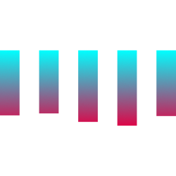

# Just Give Me Charts!

<p align="center">
 
</p>

**JGMC** is a portable lightweight library for basic, but lightning fast chart creation.

This package `core` exports various math used in the framework specific packages.

That means this package is meant mainly for use by those packages, though if you want to implement your own rendering logic this package is for you!

Otherwise check out the [Docs Website](https://danteasc4.github.io/jgmc/docs)!


## Currently Supported Charts

The following charts all have implementations for the relevant math for creating all shapes meant for SVG based outputs.

**Note that the SVG coordinate system is different from normal cartesian coordinate space.**

- Bar Charts
- Bar Chart Stacked (the bars themselves are made up of smaller bars)
- Line Chart
- Donut Chart
- Pie Chart


## Installation

```sh
npm i @jgmc/core
```

```sh
pnpm i @jgmc/core
```

```sh
bun i @jgmc/core
```

```sh
deno i npm:@jgmc/core
```

## Usage

ToDo! For now, check out tests & `@jgmc/vanilla` for an example of implementing the math.

## Development & Contributing

This project is powered by Deno, which has a lot of really convenient things to speed up development.

That being said there are a couple dev dependencies!

- The Deno runtime which you can find instructions for installing [here](https://docs.deno.com/runtime/getting_started/installation/)
- [watchexec](https://github.com/watchexec/watchexec)
    - This is for running both unit tests **&** the gallery at the same time, and re-run on change. This is useful as tests should be passing, but also when working on charts the visual output is critical. The gallery builds all charts specified at the end of test files & spits them out locally in a super fast easy to view webpage.
    - Deno's task runner provides the `recursive` flag which is awesome as it enables running multiple projects at once (tests & gallery here) but the `--watch` flag seemed to not pick up changes made to the gallery & so instead of toiling with it I just settled on using `watchexec` as it was an easy fix and has potential other useful functionality.

### Project Structure

ToDo!